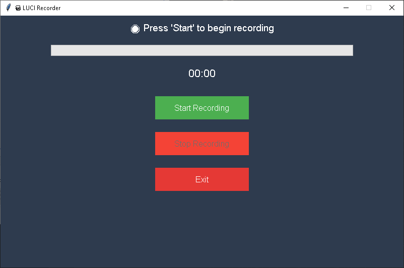

# 🖥️ OpenSource Screen Recorder (Python)

A lightweight, open-source screen recording tool built with Python. Easily capture your screen with just one click — no bloat, no ads, just pure functionality.


## ✨ Features

- 📹 Record full screen or a selected region
- 🎙️ Record system sound or microphone input (optional)
- 🎞️ Save recordings in `.mp4` or `.avi` format
- 🧊 Minimal and user-friendly GUI
- ⚡ Fast and lightweight
- 🧩 Open-source and customizable

## 🚀 Demo

 <!-- Replace with your actual GIF if available -->

## 📦 Requirements

- Python 3.7+
- `opencv-python`
- `pyautogui`
- `numpy`
- `pyaudio`
- `tkinter` (for GUI)

Install dependencies:

```bash
pip install -r requirements.txt
```

---

## 🙏 Support the Project

Love LuciChain? Help me keep it alive & growing! Your support means everything. ❤️

> 🟢 **UPI**: `gamobhai2@ybl`  
> 🧾 **Binance UID**: `783008968`

### 💰 Crypto Donations

| Coin | Address |
|------|---------|
| **USDT (TRC-20)** | `TXKPBgR9d5xq5KpAyd2maPVQuEEDZ9DgiQ` |
| **BTC** | `1JeBUw4bjL9tuKrHwKKk4dx3mPy1jxys8j` |
| **LTC** | `LPUR2CE5SfArfYRJWkdtqhGz3t17Rijz2d` |

---
